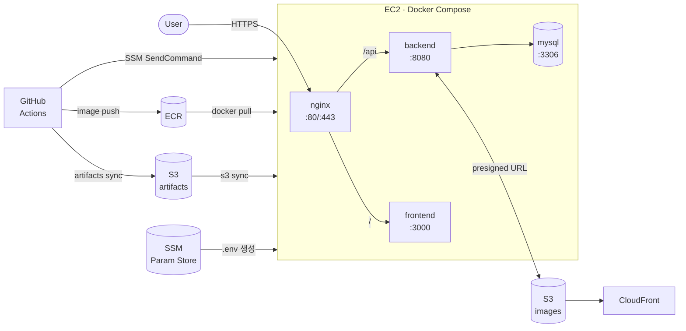

# wepick-infra

wepick 서비스의 AWS 인프라 코드 및 배포 스크립트.
Terraform 3-레이어 구조(bootstrap → shared → prod)로 관리하며, GitHub Actions OIDC로 배포한다.



---

## 구조

```
terraform/envs/
├── bootstrap/   # tfstate S3 버킷 + GitHub OIDC Provider (로컬 state)
├── shared/      # IAM Role, ECR, OIDC Deploy Role (계정 공유 자원)
└── prod/        # VPC, EC2, S3, CloudFront, SSM 파라미터

scripts/
└── deploy-on-ec2.sh   # SSM SendCommand로 EC2에서 실행하는 배포 스크립트

docker/prod/
└── docker-compose.yml

nginx/prod/
└── wepick.conf        # envsubst로 도메인 치환하는 nginx 설정 템플릿

.github/workflows/
├── compose-sync.yml   # docker/prod, nginx/prod, scripts 변경 시 artifacts S3 업로드
├── deploy-nginx.yml   # compose-sync 성공 시 nginx 자동 재기동
└── deploy.yml         # 수동 서비스 배포 (all / backend / frontend / nginx / mysql)
```

**레이어 의존 관계:**

```
bootstrap (로컬 state)
    └── shared (S3 state, bootstrap output 참조)
            └── prod (S3 state, shared output 참조)
```

---

## 로컬 설정

레포 클론 후 한 번만 실행한다:

```bash
git config core.hooksPath .githooks
```

`terraform/` 변경을 main에 직접 커밋하면 pre-commit 훅이 차단한다.

---

## 문서

| 문서 | 내용 |
|------|------|
| [아키텍처](docs/architecture.md) | 인프라 구조도 + 초기 배포 시퀀스 다이어그램 |
| [초기 배포 절차](docs/initial-deployment.md) | 아무것도 없는 AWS 계정에서 prod까지 8단계 |
