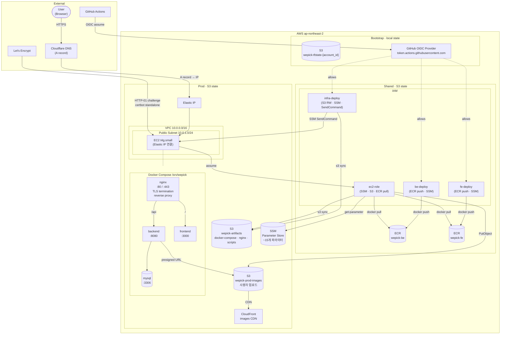
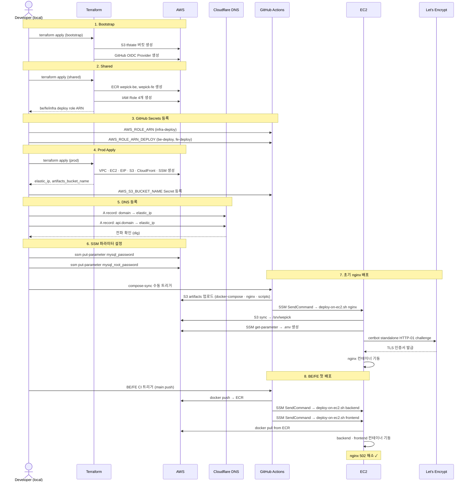

# Architecture

## 인프라 구조

```mermaid
flowchart TB
    subgraph ext["External"]
        User(["User\n(Browser)"])
        DNS["Cloudflare DNS\n(A record)"]
        GHA["GitHub Actions"]
        LE["Let's Encrypt"]
    end

    subgraph aws["AWS ap-northeast-2"]

        subgraph bootstrap["Bootstrap  ·  local state"]
            TF_S3[("S3\nwepick-tfstate-{account_id}")]
            OIDC["GitHub OIDC Provider\ntoken.actions.githubusercontent.com"]
        end

        subgraph shared["Shared  ·  S3 state"]
            ECR_BE[("ECR\nwepick-be")]
            ECR_FE[("ECR\nwepick-fe")]

            subgraph iam["IAM"]
                ROLE_EC2["ec2-role\n(SSM · S3 · ECR pull)"]
                ROLE_BE["be-deploy\n(ECR push · SSM)"]
                ROLE_FE["fe-deploy\n(ECR push · SSM)"]
                ROLE_INFRA["infra-deploy\n(S3 RW · SSM · SendCommand)"]
            end
        end

        subgraph prod["Prod  ·  S3 state"]
            EIP["Elastic IP"]
            S3_ART[("S3\nwepick-artifacts\ndocker-compose · nginx · scripts")]
            S3_IMG[("S3\nwepick-prod-images\n사용자 업로드")]
            CF["CloudFront\nimages CDN"]
            SSM[("SSM\nParameter Store\n~15개 파라미터")]

            subgraph vpc["VPC  10.0.0.0/16"]
                subgraph subnet["Public Subnet  10.0.1.0/24"]
                    EC2["EC2  t4g.small\n(Elastic IP 연결)"]
                end
            end

            subgraph docker["Docker Compose  /srv/wepick"]
                NGX["nginx\n:80 / :443\nTLS termination\nreverse proxy"]
                BE["backend\n:8080"]
                FE["frontend\n:3000"]
                DB[("mysql\n:3306")]
            end
        end
    end

    %% 사용자 트래픽
    User -->|"HTTPS"| DNS
    DNS -->|"A record → IP"| EIP
    EIP --> EC2
    EC2 -.- docker

    %% 컨테이너 내부
    NGX -->|"/api"| BE
    NGX -->|"/"| FE
    BE --> DB
    BE -->|"presigned URL"| S3_IMG
    S3_IMG -->|"CDN"| CF

    %% GitHub Actions OIDC
    GHA -->|"OIDC assume"| OIDC
    OIDC -.->|"allows"| ROLE_INFRA
    OIDC -.->|"allows"| ROLE_BE
    OIDC -.->|"allows"| ROLE_FE

    %% infra deploy
    ROLE_INFRA -->|"s3 sync"| S3_ART
    ROLE_INFRA -->|"SSM SendCommand"| EC2

    %% BE/FE deploy
    ROLE_BE -->|"docker push"| ECR_BE
    ROLE_FE -->|"docker push"| ECR_FE

    %% EC2 런타임 접근
    EC2 -->|"assume"| ROLE_EC2
    ROLE_EC2 -->|"get-parameter"| SSM
    ROLE_EC2 -->|"s3 sync"| S3_ART
    ROLE_EC2 -->|"docker pull"| ECR_BE
    ROLE_EC2 -->|"docker pull"| ECR_FE
    ROLE_EC2 -->|"PutObject"| S3_IMG

    %% TLS
    LE -->|"HTTP-01 challenge\ncertbot standalone"| EC2
```

---

## 초기 배포 흐름

```mermaid
sequenceDiagram
    actor Dev as Developer (local)
    participant TF as Terraform
    participant AWS as AWS
    participant DNS as Cloudflare DNS
    participant GHA as GitHub Actions
    participant EC2 as EC2
    participant LE as Let's Encrypt

    Note over Dev,AWS: 1. Bootstrap
    Dev->>TF: terraform apply (bootstrap)
    TF->>AWS: S3 tfstate 버킷 생성
    TF->>AWS: GitHub OIDC Provider 생성

    Note over Dev,AWS: 2. Shared
    Dev->>TF: terraform apply (shared)
    TF->>AWS: ECR wepick-be, wepick-fe 생성
    TF->>AWS: IAM Role 4개 생성
    TF-->>Dev: be/fe/infra deploy role ARN

    Note over Dev,GHA: 3. GitHub Secrets 등록
    Dev->>GHA: AWS_ROLE_ARN (infra-deploy)
    Dev->>GHA: AWS_ROLE_ARN_DEPLOY (be-deploy, fe-deploy)

    Note over Dev,AWS: 4. Prod Apply
    Dev->>TF: terraform apply (prod)
    TF->>AWS: VPC · EC2 · EIP · S3 · CloudFront · SSM 생성
    TF-->>Dev: elastic_ip, artifacts_bucket_name
    Dev->>GHA: AWS_S3_BUCKET_NAME Secret 등록

    Note over Dev,DNS: 5. DNS 등록
    Dev->>DNS: A record: domain → elastic_ip
    Dev->>DNS: A record: api.domain → elastic_ip
    DNS-->>Dev: 전파 확인 (dig)

    Note over Dev,AWS: 6. SSM 파라미터 설정
    Dev->>AWS: ssm put-parameter mysql_password
    Dev->>AWS: ssm put-parameter mysql_root_password

    Note over GHA,LE: 7. 초기 nginx 배포
    Dev->>GHA: compose-sync 수동 트리거
    GHA->>AWS: S3 artifacts 업로드 (docker-compose · nginx · scripts)
    GHA->>EC2: SSM SendCommand → deploy-on-ec2.sh nginx
    EC2->>AWS: S3 sync → /srv/wepick
    EC2->>AWS: SSM get-parameter → .env 생성
    EC2->>LE: certbot standalone HTTP-01 challenge
    LE-->>EC2: TLS 인증서 발급
    EC2->>EC2: nginx 컨테이너 기동

    Note over GHA,EC2: 8. BE/FE 첫 배포
    Dev->>GHA: BE/FE CI 트리거 (main push)
    GHA->>AWS: docker push → ECR
    GHA->>EC2: SSM SendCommand → deploy-on-ec2.sh backend
    GHA->>EC2: SSM SendCommand → deploy-on-ec2.sh frontend
    EC2->>AWS: docker pull from ECR
    EC2->>EC2: backend · frontend 컨테이너 기동
    Note over EC2: nginx 502 해소 ✓
```
